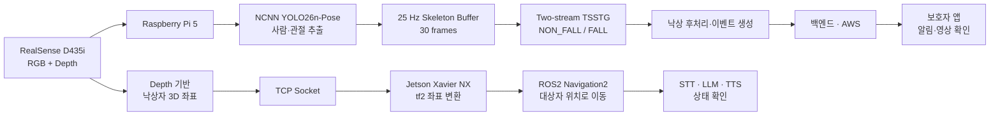
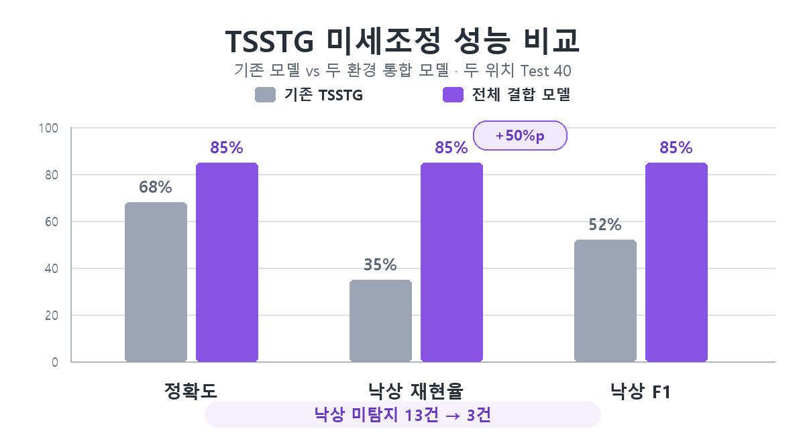

# RealSense 기반 낙상 감지·대응 시스템

Intel RealSense D435i, Raspberry Pi 5, NCNN YOLO26n-Pose와 TSSTG를 이용해 낙상을 감지하고, 낙상 위치를 자율주행 로봇과 보호자 서비스로 전달하는 시니어 케어 프로토타입입니다.

이 저장소는 전체 시스템 중 **RGB-D 기반 낙상 감지, 현장 데이터 수집, TSSTG 미세조정과 Raspberry Pi 실시간 추론**을 중심으로 구성되어 있습니다.

## 시연 영상

<p align="center">
  <a href="https://youtu.be/Ehhn0QrakcE">
    
  </a>
</p>

<p align="center"><b>이미지를 클릭하면 전체 시스템 시연 영상을 볼 수 있습니다.</b></p>

## 전체 시스템 파이프라인



## 낙상 모델 구조

```text
RGB 640×480 @ 30 FPS
        │
        ▼
NCNN YOLO26n-Pose @ 약 25 FPS
  ├─ Bounding Box: 대상자 추적·Depth 위치 계산
  └─ COCO 17 keypoints → 눈·귀 4개 제외 → 13 keypoints
        │
        ▼
13개 관절 + 어깨 중심점 = 14-node Skeleton
좌표 (x, y) + 관절 신뢰도
        │
        ▼
25 Hz × 30 frames = 약 1.2초
        │
        ├─ Pose stream
        └─ Motion stream (프레임 간 관절 이동량)
        │
        ▼
Two-Stream Spatial Temporal Graph
        │
        ▼
NON_FALL / FALL
```

TSSTG 입력에는 Bounding Box를 사용하지 않습니다. Bounding Box는 사람 추적, 수집 품질 확인과 Depth 좌표 계산에만 사용합니다.

## 핵심 차별점

### 1. 학습 조건과 실시간 입력 속도 일치

Raspberry Pi에서 PyTorch YOLO Pose는 약 5 FPS로 동작해 30프레임이 약 6초를 나타냈습니다. NCNN으로 변환해 약 25 FPS를 확보함으로써 TSSTG 사전학습 조건과 동일하게 30프레임이 약 1.2초의 동작을 나타내도록 했습니다.

### 2. 두 환경에서 직접 수집한 균형 데이터 200건

| 환경 | 낙상 | 비낙상 | 합계 |
|---|---:|---:|---:|
| 강의실 | 50 | 50 | 100 |
| 침대가 포함된 가정 환경 | 50 | 50 | 100 |
| **전체** | **100** | **100** | **200** |

- 낙상: 전방, 후방, 좌·우 측방, 보행·방향 전환 중 낙상, 천천히 주저앉기
- 비낙상: 걷기·멈춤, 착석·정상적으로 눕기, 물건 줍기·쪼그리기, 비틀거린 뒤 회복, 바닥 생활
- 변화 조건: 위치, 거리, 신체 방향, 조명, 복장, 바닥·침대 환경

### 3. 실제 낙상 구간을 자동으로 선택

4초 영상을 바로 FALL로 지정하지 않고, 관절의 높이·하강량·움직임을 이용해 `fall_start`와 `impact`를 추정합니다. 두 시점이 포함된 핵심 30프레임만 학습에 사용하여 준비 자세나 회복 자세가 낙상으로 학습되는 것을 줄였습니다.

### 4. 배포 입력과 동일한 Skeleton으로 미세조정

- 기존 7-class TSSTG에서 시작
- `NON_FALL / FALL` 이진 분류 Head 학습
- 이후 전체 네트워크 미세조정
- 좌우 반전과 XY Gaussian noise 증강
- 최종 배포 모델: seed 42, temporal pose dropout 미적용 전체 결합 모델

## 성능

| 평가 범위 | 모델 | 정확도 | 낙상 재현율 | 낙상 F1 |
|---|---|---:|---:|---:|
| 독립 Test 20 | 기존 TSSTG | 70% | 40% | 57.1% |
| 독립 Test 20 | 전체 결합 모델 | **80%** | **80%** | **80%** |
| 확대 Test 40¹ | 기존 TSSTG | 67.5% | 35% | 51.9% |
| 확대 Test 40¹ | 전체 결합 모델 | **85%** | **85%** | **85%** |



¹ Test 40은 Validation 20건과 독립 Test 20건을 합친 보조 분석입니다. 최종 독립 성능은 Test 20을 기준으로 해석합니다.

## 데이터 수집·학습 흐름

1. RGB를 약 4초 동안 메모리에만 수집합니다.
2. 25 Hz 시간축에 가장 가까운 고유 프레임 100장을 선택합니다.
3. 고유 프레임 수 또는 최대 시간 오차 30 ms 조건을 만족하지 못하면 자동 폐기합니다.
4. RGB+Skeleton 검수 영상을 승인한 샘플만 저장합니다.
5. 관절 기반으로 30프레임 핵심 구간을 생성합니다.
6. 이벤트 단위 고정 분할 후 Colab에서 Head 학습과 전체 미세조정을 수행합니다.

수집은 중단 후 재실행해도 `events.jsonl`을 기준으로 다음 미완료 이벤트부터 이어집니다.

## 필요한 모델 파일

가중치는 Git 저장소에서 제외하고 Git LFS 또는 GitHub Release로 배포합니다.

| 용도 | 배치 경로 |
|---|---|
| NCNN YOLO26n-Pose | `models/pose/yolo26n-pose_ncnn_model/` |
| PyTorch Pose 비교용(선택) | `models/pose/yolo26n-pose.pt` |
| 이진 TSSTG | `raspberrypi_haniuim/Models/TSSTG/tsstg-model.pth` |

이진 TSSTG의 출력 Head는 2개이며 클래스 순서는 `['NON_FALL', 'FALL']`입니다.

## 빠른 시작

### 설치

```powershell
python -m venv .venv
.\.venv\Scripts\Activate.ps1
pip install -r requirements.txt
```

RealSense와 NCNN은 운영체제·장치에 맞는 librealsense 및 NCNN 런타임 설정이 추가로 필요할 수 있습니다.

### 장소별 데이터 수집

```powershell
# 장소 1: 100건
python -m tsstg_pipeline.collect `
  --subject-id S001 `
  --location location_1 `
  --ncnn-threads 2

# 장소 2: 장소 1 완료 후 100건
python -m tsstg_pipeline.collect `
  --subject-id S001 `
  --location location_2 `
  --ncnn-threads 2
```

### 30프레임 데이터셋 생성

```powershell
python -m tsstg_pipeline.build_dataset `
  --input .\collected_pose_data\S001 `
  --output .\tsstg_binary_dataset\S001_full200_compare `
  --split-mode location_stratified `
  --split-seed 42 `
  --exclude-train-event-id S001_E101
```

### 미세조정

```powershell
python -m tsstg_pipeline.train_pilot `
  --dataset .\tsstg_binary_dataset\S001_full200_compare `
  --output .\run_full200_nodropout_seed42 `
  --head-epochs 15 `
  --finetune-epochs 30 `
  --temporal-dropout-probability 0 `
  --temporal-dropout-max-frames 0 `
  --seed 42
```

학습은 CUDA GPU가 제공되는 Google Colab을 권장합니다.

### Raspberry Pi 실시간 실행

```bash
export POSE_BACKEND=ncnn
export NCNN_THREADS=2
export BACKEND_URL=http://<backend-host>:8080
export MQTT_BROKER=<mqtt-host>
python3 apps/realtime_fall_detection.py
```

배포 전 `ActionsEstLoader.py`의 클래스가 `['NON_FALL', 'FALL']`, 모델 출력 수가 2인지 확인해야 합니다. 기존 7-class 가중치와 이진 분류 가중치는 Head 크기가 달라 단순 파일 덮어쓰기로 교체할 수 없습니다.

## 저장소 구조

```text
apps/                 Raspberry Pi 실시간 낙상 감지 앱
tsstg_pipeline/       수집·데이터셋 생성·학습·평가·시각화
raspberrypi_haniuim/  TSSTG 및 Skeleton 전처리 구현
models/               Pose 모델 구조와 배치 위치
docs/                 수집 명세·실험 및 Colab 가이드
tools/                데이터 점검·복구·보고서 시각화 도구
analysis/             재현 가능한 성능 분석 결과
```

원본 RGB 영상, 수집 데이터, 생성 데이터셋, 학습 가중치와 외부 서비스 자격정보는 Git 저장소에 포함하지 않습니다. 모델 파일은 Git LFS 또는 GitHub Release로 별도 배포하는 것을 권장합니다.

## 주요 문서

- [200건 수집 명세](docs/TSSTG_ONE_PERSON_200_COLLECTION_SPEC_KO.txt)
- [두 장소 비교 실험](docs/TSSTG_200_EXPERIMENT_KO.md)
- [Colab 학습 가이드](docs/COLAB_PILOT100_KO.md)

## 주의 사항

본 프로젝트는 연구·프로토타입 단계이며 의료기기 또는 안전 인증 시스템이 아닙니다. 실제 환경에 적용하려면 다양한 사용자, 카메라 위치와 주거 환경에 대한 추가 검증이 필요합니다.
